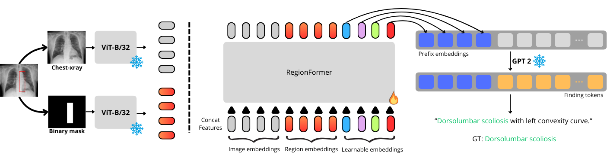

# RegionFormer — Official Code Repository

This repository contains the **official implementation** of the paper:

📄 **Paper:** *Does Grounding Improve Radiology Report Generation? An Empirical Study on PadChest-GR*
🔗 **Link:** [Comming Soon!!]

-----

## Model Architecture

Below is the architecture diagram used in the paper:



-----

## Dataset

This work is built upon the **PadChest-GR** dataset:
🔗 [https://arxiv.org/abs/2411.05085](https://arxiv.org/abs/2411.05085)

Make sure to download and place the dataset following the directory structure expected by the parsing script (see instructions below).

-----

## 1\. Environment Setup 🐍

Create and activate the conda environment:

```bash
conda env create -f environment.yml
conda activate regionformer
```

-----

## 2\. Dataset Preprocessing 🛠️

Run the following script to parse the raw dataset and generate the necessary **`.pkl`** files used for training:

```bash
python parse_padchestgr_jpg_region.py \
  --images_root data/padchestgr/PadChest_GR \
  --train_csv  data/padchestgr/train_final_separated.csv \
  --test_csv   data/padchestgr/test_final_separated.csv \
  --clip_model_type ViT-B/32
```

This script generates the preprocessed data structures (including CLIP embeddings) required for the subsequent training step.

-----

## 3\. Running Experiments 🚀

### Base Training (Experiment 1)

Execute the main experiment with the following script:

```bash
./run_experiment.sh
```

### Training with Percentage Data (Experiment 2)

The code for **Experiment 2** (Training with varying percentages of the dataset) described in the paper is available in the **`train-percentage`** branch.

To run this experiment, you must checkout the branch and execute:

```bash
git checkout train-percentage
./run_experiment_percentage.sh
```

### Attention Map Visualization 👀

A separate branch, **`show-attention-map`**, is available to visualize the model's attention maps.

After checking out this branch, the code will run normally (as in the `main` branch), but it will **print the input images with the attention map overlay**.

```bash
git checkout show-attention-map
```